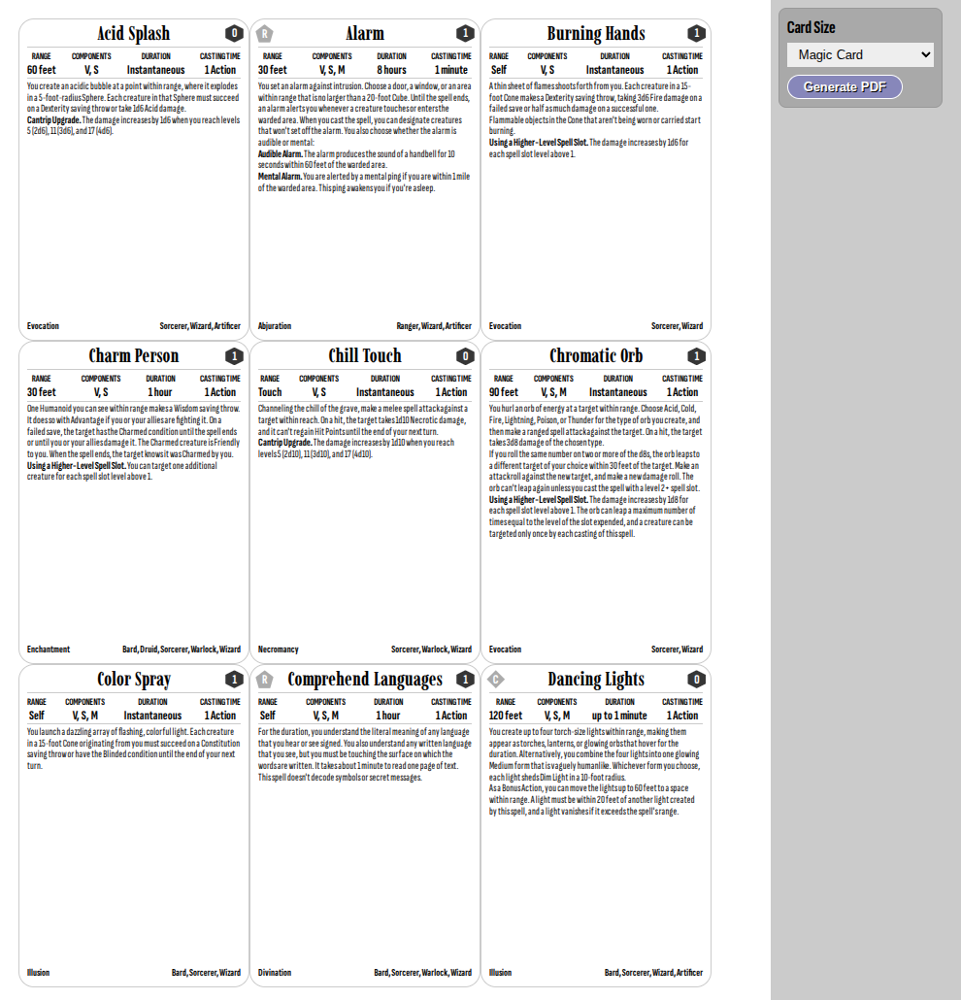

# D&D Spell Cards Generator
Creates A4 print sheets with dynamic card sizes

## Card Sizes
 * Max Size: with 0.5cm border - for Copy Shops
 * Magic: 6.3 x 8.8 cm (3x3 Grid)
 * Tarot: 7 x 12 cm (2x2 Grid)

## Screenshot
 

## Technology
 * Vanilla DOM JS for generation (React would be overkill)
 * Layouting via my own (S)CSS
 * Vite for development
 * print via browser print function (switch off borders/etc.)

## TODO
 * generating PDF from HTML, as alternative to browser print function
 * migrate from vanilla javascript to React, now that more filter functionality is coming
